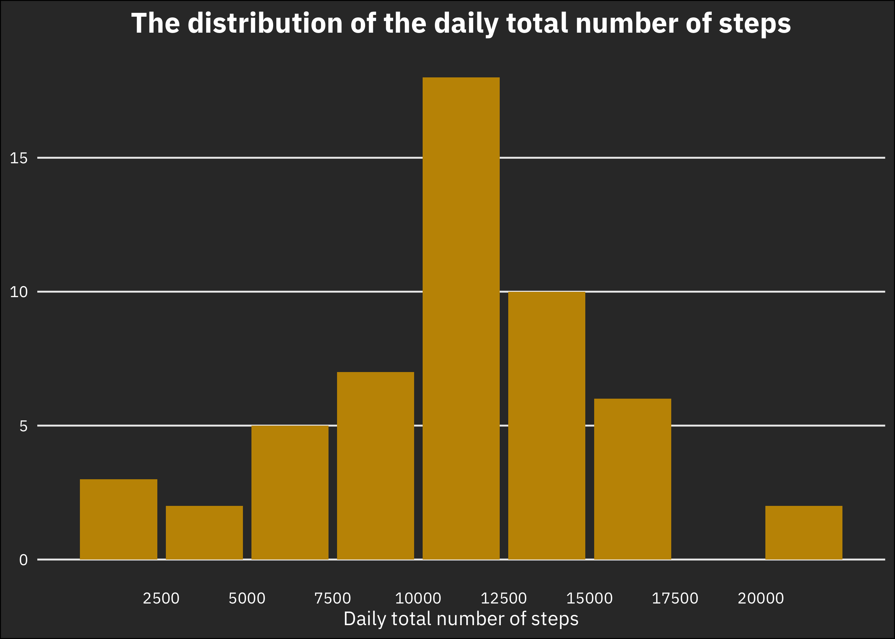

This is my submission to the first course project of Reproducible Research[1] —— the fifth course of the John Hopkin's Data Science Specialization on Coursera. This assignment makes use of data[2] from a personal activity monitoring device. This device collects data at 5 minute intervals through out the day. The data consists of two months of data from an anonymous individual collected during the months of October and November, 2012 and include the number of steps taken in 5 minute intervals each day. The code chunk below shows the global options I have setup for the analysis.


```r
knitr::opts_chunk$set(
  echo = TRUE, cache = TRUE, warning = FALSE,
  message = FALSE, dpi = 180, tidy = TRUE
)
library(tidyverse) #package required for basic data manipulation and plotting
library(silgelib) #package required for theme_plex()
theme_set(theme_plex()) #custom ggplot2 theme
library(knitr) #package required for printing out nicely formatted tables.
library(lubridate) #package required for the wday() function
```

## Loading and preprocessing the data

```r
# unzip the data file if the file doesn't already exist.
if (!file.exists("activity.zip")) {
  unzip("activity.zip")
}
activityData <- read_csv("activity.csv")  #Load data
```

## What is mean total number of steps taken per day?
**1. Histogram of the total number of steps per day:** 

```r
# removing all rows with NAs
activityData_na.rm <- activityData %>% na.omit()

# some data manipulation for the plot
data_total_daily_steps <- activityData_na.rm %>%
  group_by(date) %>%
  summarize(total_daily_steps = sum(steps), mean = mean(steps), median = median(steps))

## ggplot histogram of the total number of steps per day.
data_total_daily_steps %>%
  ggplot(aes(total_daily_steps)) +
  geom_bar(fill = "#c49300") +
  scale_x_binned() +
  xlab("Daily total number of steps") +
  ylab(NULL) +
  labs(title = "The distribution of the daily total number of steps") +
  theme(
    panel.grid.major.x = element_blank(),             #remove all major gridlines in the x direction
    panel.grid.minor.y = element_blank(),             #remove all minor gridlines in the y direction
    plot.background = element_rect(fill = "#343434"), #fill plot background with custom shade of grey
    axis.text = element_text(colour = "white"),       #format the axis text in the x and y axes.
    axis.title = element_text(colour = "white", face = "bold"),                #format the axis title
    plot.title = element_text(colour = "white", face = "bold", hjust = 0.5)    #format the plot title
  )
```

<!-- -->


**2.  Calculate and report the mean and median of the total number of steps taken per day:** The mean and median total number of steps per day is calculated as seen in the table below

```r
#define a vecor of column names to be used in the printed table
column_names <- c("Date", "Total Steps per Day", 
                  "Mean Total Steps per day",
                  "Median Total Steps per day")
#printing out the first 15 rows of the dataset
head(data_total_daily_steps, 15) %>% kable(format = "html", col.names = column_names)
```

<table>
 <thead>
  <tr>
   <th style="text-align:left;"> Date </th>
   <th style="text-align:right;"> Total Steps per Day </th>
   <th style="text-align:right;"> Mean Total Steps per day </th>
   <th style="text-align:right;"> Median Total Steps per day </th>
  </tr>
 </thead>
<tbody>
  <tr>
   <td style="text-align:left;"> 2012-10-02 </td>
   <td style="text-align:right;"> 126 </td>
   <td style="text-align:right;"> 0.43750 </td>
   <td style="text-align:right;"> 0 </td>
  </tr>
  <tr>
   <td style="text-align:left;"> 2012-10-03 </td>
   <td style="text-align:right;"> 11352 </td>
   <td style="text-align:right;"> 39.41667 </td>
   <td style="text-align:right;"> 0 </td>
  </tr>
  <tr>
   <td style="text-align:left;"> 2012-10-04 </td>
   <td style="text-align:right;"> 12116 </td>
   <td style="text-align:right;"> 42.06944 </td>
   <td style="text-align:right;"> 0 </td>
  </tr>
  <tr>
   <td style="text-align:left;"> 2012-10-05 </td>
   <td style="text-align:right;"> 13294 </td>
   <td style="text-align:right;"> 46.15972 </td>
   <td style="text-align:right;"> 0 </td>
  </tr>
  <tr>
   <td style="text-align:left;"> 2012-10-06 </td>
   <td style="text-align:right;"> 15420 </td>
   <td style="text-align:right;"> 53.54167 </td>
   <td style="text-align:right;"> 0 </td>
  </tr>
  <tr>
   <td style="text-align:left;"> 2012-10-07 </td>
   <td style="text-align:right;"> 11015 </td>
   <td style="text-align:right;"> 38.24653 </td>
   <td style="text-align:right;"> 0 </td>
  </tr>
  <tr>
   <td style="text-align:left;"> 2012-10-09 </td>
   <td style="text-align:right;"> 12811 </td>
   <td style="text-align:right;"> 44.48264 </td>
   <td style="text-align:right;"> 0 </td>
  </tr>
  <tr>
   <td style="text-align:left;"> 2012-10-10 </td>
   <td style="text-align:right;"> 9900 </td>
   <td style="text-align:right;"> 34.37500 </td>
   <td style="text-align:right;"> 0 </td>
  </tr>
  <tr>
   <td style="text-align:left;"> 2012-10-11 </td>
   <td style="text-align:right;"> 10304 </td>
   <td style="text-align:right;"> 35.77778 </td>
   <td style="text-align:right;"> 0 </td>
  </tr>
  <tr>
   <td style="text-align:left;"> 2012-10-12 </td>
   <td style="text-align:right;"> 17382 </td>
   <td style="text-align:right;"> 60.35417 </td>
   <td style="text-align:right;"> 0 </td>
  </tr>
  <tr>
   <td style="text-align:left;"> 2012-10-13 </td>
   <td style="text-align:right;"> 12426 </td>
   <td style="text-align:right;"> 43.14583 </td>
   <td style="text-align:right;"> 0 </td>
  </tr>
  <tr>
   <td style="text-align:left;"> 2012-10-14 </td>
   <td style="text-align:right;"> 15098 </td>
   <td style="text-align:right;"> 52.42361 </td>
   <td style="text-align:right;"> 0 </td>
  </tr>
  <tr>
   <td style="text-align:left;"> 2012-10-15 </td>
   <td style="text-align:right;"> 10139 </td>
   <td style="text-align:right;"> 35.20486 </td>
   <td style="text-align:right;"> 0 </td>
  </tr>
  <tr>
   <td style="text-align:left;"> 2012-10-16 </td>
   <td style="text-align:right;"> 15084 </td>
   <td style="text-align:right;"> 52.37500 </td>
   <td style="text-align:right;"> 0 </td>
  </tr>
  <tr>
   <td style="text-align:left;"> 2012-10-17 </td>
   <td style="text-align:right;"> 13452 </td>
   <td style="text-align:right;"> 46.70833 </td>
   <td style="text-align:right;"> 0 </td>
  </tr>
</tbody>
</table>


## What is the average daily activity pattern?
**1. Time series plot of the 5-minute interval (x-axis) and the average number of steps taken, averaged across all days (y-axis):** 

```r
# some data manipulation to get the required dataframe for the plot.
data_interval_avg <- activityData_na.rm %>%
  group_by(interval) %>%
  summarize(daily_avg = mean(steps)) %>%
  ungroup()

#ggplot2 code for the required vizualization
data_interval_avg %>%
  ggplot(aes(interval, daily_avg)) +
  geom_line(col = "#c49300", size = 1.1) +          #modifying the thickness of the line and the color
  ylim(0, 250) +                                    #expanding the limits of the y axis to 250
  xlab("Interval") +                                
  ylab("Daily average steps per interval") +
  labs(title = "Average Daily activity pattern") +
  theme(
    panel.grid.major.x = element_blank(),           #removing all major gridlines in the x direction
    panel.grid.minor.x = element_blank(),           #removing all minor gridlines in the x direction
    panel.grid.minor.y = element_blank(),           #removing all minor gridlines in the y direction
    plot.background = element_rect(fill = "#343434"),    #set plot background to a custom grey color
    axis.text = element_text(colour = "white"),          #format the axis texts in the x and y axes
    axis.title = element_text(colour = "white", face = "bold"),               #format the axis text
    plot.title = element_text(colour = "white", face = "bold", hjust = 0.5) #format the plot title text
  ) 
```

<!-- -->

```r
max_steps <- max(data_interval_avg$daily_avg)
interval_max_steps <- data_interval_avg$interval[data_interval_avg$daily_avg == max_steps]
```
**2. Which 5-minute interval, on average across all the days in the dataset, contains the maximum number of steps?:** From the data, it is evident that interval **835** has the highest average number of steps across the days in the data.

## Impute missing values


```r
# Calculating total missing values and storing it in a variable
total_missing_values <- sum(is.na(activityData))
```
**1. Calculate and report the total number of missing values in the dataset:** The total number of missing values in the data is **2304**  
**2. Devise a strategy for filling in all of the missing values in the dataset:** The missing values would be inputed using the mean for 5-minute-interval across the days.  
**3. Create a new dataset that is equal to the original dataset but with the missing data filled in:**  


```r
# join the activityData with the data on interval average by interval to compute missing values
activityData_na.impute <- activityData %>%
  inner_join(data_interval_avg, by = "interval") %>%
  mutate(steps = ifelse(is.na(steps), daily_avg, steps)) %>%
  select(-daily_avg)
#print out the first few rows of the imputed dataset
kable(head(activityData_na.impute), format = "html", col.names = c("Steps", "Date", "Interval"))
```

<table>
 <thead>
  <tr>
   <th style="text-align:right;"> Steps </th>
   <th style="text-align:left;"> Date </th>
   <th style="text-align:right;"> Interval </th>
  </tr>
 </thead>
<tbody>
  <tr>
   <td style="text-align:right;"> 1.7169811 </td>
   <td style="text-align:left;"> 2012-10-01 </td>
   <td style="text-align:right;"> 0 </td>
  </tr>
  <tr>
   <td style="text-align:right;"> 0.3396226 </td>
   <td style="text-align:left;"> 2012-10-01 </td>
   <td style="text-align:right;"> 5 </td>
  </tr>
  <tr>
   <td style="text-align:right;"> 0.1320755 </td>
   <td style="text-align:left;"> 2012-10-01 </td>
   <td style="text-align:right;"> 10 </td>
  </tr>
  <tr>
   <td style="text-align:right;"> 0.1509434 </td>
   <td style="text-align:left;"> 2012-10-01 </td>
   <td style="text-align:right;"> 15 </td>
  </tr>
  <tr>
   <td style="text-align:right;"> 0.0754717 </td>
   <td style="text-align:left;"> 2012-10-01 </td>
   <td style="text-align:right;"> 20 </td>
  </tr>
  <tr>
   <td style="text-align:right;"> 2.0943396 </td>
   <td style="text-align:left;"> 2012-10-01 </td>
   <td style="text-align:right;"> 25 </td>
  </tr>
</tbody>
</table>

**4. Make a histogram of the total number of steps taken each day and Calculate and report the mean and median total number of steps taken per day:** The values do not differ much from the previous estimates. 

```r
df <- activityData_na.impute %>%
  group_by(date) %>% 
  summarize(total_daily_steps2 = sum(steps), median = median(steps), mean = mean(steps))
#printing the first 15 rows of the data
kable(head(df, 15), format = "html")
```

<table>
 <thead>
  <tr>
   <th style="text-align:left;"> date </th>
   <th style="text-align:right;"> total_daily_steps2 </th>
   <th style="text-align:right;"> median </th>
   <th style="text-align:right;"> mean </th>
  </tr>
 </thead>
<tbody>
  <tr>
   <td style="text-align:left;"> 2012-10-01 </td>
   <td style="text-align:right;"> 10766.19 </td>
   <td style="text-align:right;"> 34.11321 </td>
   <td style="text-align:right;"> 37.38260 </td>
  </tr>
  <tr>
   <td style="text-align:left;"> 2012-10-02 </td>
   <td style="text-align:right;"> 126.00 </td>
   <td style="text-align:right;"> 0.00000 </td>
   <td style="text-align:right;"> 0.43750 </td>
  </tr>
  <tr>
   <td style="text-align:left;"> 2012-10-03 </td>
   <td style="text-align:right;"> 11352.00 </td>
   <td style="text-align:right;"> 0.00000 </td>
   <td style="text-align:right;"> 39.41667 </td>
  </tr>
  <tr>
   <td style="text-align:left;"> 2012-10-04 </td>
   <td style="text-align:right;"> 12116.00 </td>
   <td style="text-align:right;"> 0.00000 </td>
   <td style="text-align:right;"> 42.06944 </td>
  </tr>
  <tr>
   <td style="text-align:left;"> 2012-10-05 </td>
   <td style="text-align:right;"> 13294.00 </td>
   <td style="text-align:right;"> 0.00000 </td>
   <td style="text-align:right;"> 46.15972 </td>
  </tr>
  <tr>
   <td style="text-align:left;"> 2012-10-06 </td>
   <td style="text-align:right;"> 15420.00 </td>
   <td style="text-align:right;"> 0.00000 </td>
   <td style="text-align:right;"> 53.54167 </td>
  </tr>
  <tr>
   <td style="text-align:left;"> 2012-10-07 </td>
   <td style="text-align:right;"> 11015.00 </td>
   <td style="text-align:right;"> 0.00000 </td>
   <td style="text-align:right;"> 38.24653 </td>
  </tr>
  <tr>
   <td style="text-align:left;"> 2012-10-08 </td>
   <td style="text-align:right;"> 10766.19 </td>
   <td style="text-align:right;"> 34.11321 </td>
   <td style="text-align:right;"> 37.38260 </td>
  </tr>
  <tr>
   <td style="text-align:left;"> 2012-10-09 </td>
   <td style="text-align:right;"> 12811.00 </td>
   <td style="text-align:right;"> 0.00000 </td>
   <td style="text-align:right;"> 44.48264 </td>
  </tr>
  <tr>
   <td style="text-align:left;"> 2012-10-10 </td>
   <td style="text-align:right;"> 9900.00 </td>
   <td style="text-align:right;"> 0.00000 </td>
   <td style="text-align:right;"> 34.37500 </td>
  </tr>
  <tr>
   <td style="text-align:left;"> 2012-10-11 </td>
   <td style="text-align:right;"> 10304.00 </td>
   <td style="text-align:right;"> 0.00000 </td>
   <td style="text-align:right;"> 35.77778 </td>
  </tr>
  <tr>
   <td style="text-align:left;"> 2012-10-12 </td>
   <td style="text-align:right;"> 17382.00 </td>
   <td style="text-align:right;"> 0.00000 </td>
   <td style="text-align:right;"> 60.35417 </td>
  </tr>
  <tr>
   <td style="text-align:left;"> 2012-10-13 </td>
   <td style="text-align:right;"> 12426.00 </td>
   <td style="text-align:right;"> 0.00000 </td>
   <td style="text-align:right;"> 43.14583 </td>
  </tr>
  <tr>
   <td style="text-align:left;"> 2012-10-14 </td>
   <td style="text-align:right;"> 15098.00 </td>
   <td style="text-align:right;"> 0.00000 </td>
   <td style="text-align:right;"> 52.42361 </td>
  </tr>
  <tr>
   <td style="text-align:left;"> 2012-10-15 </td>
   <td style="text-align:right;"> 10139.00 </td>
   <td style="text-align:right;"> 0.00000 </td>
   <td style="text-align:right;"> 35.20486 </td>
  </tr>
</tbody>
</table>

```r
df %>% 
  ggplot(aes(total_daily_steps2)) +
  geom_bar(fill = "#c49300") +
  scale_x_binned() +
  xlab("Daily total number of steps") +
  ylab(NULL) +
  labs(title = "The distribution of the daily total number of steps") +
  theme(
    panel.grid.major.x = element_blank(),
    panel.grid.minor.y = element_blank(),
    plot.background = element_rect(fill = "#343434"),
    axis.text = element_text(colour = "white"),
    axis.title = element_text(colour = "white", face = "bold"),
    plot.title = element_text(colour = "white", face = "bold", hjust = 0.5)
  )
```

<!-- -->

## Are there differences in activity patterns between weekdays and weekends?

```r
 activityData_na.impute %>% 
mutate(day_type = lubridate::wday(date)) %>% 
mutate(day_type = as.factor(ifelse(day_type <= 5, "Weekday", "Weekend")))  %>% 
  group_by(interval, day_type) %>% 
  summarize(avg_steps = mean(steps)) %>% 
  ggplot(aes(x = interval, y = avg_steps)) +
  geom_line(col = "#c49300", size = 1.1) +
  facet_wrap(~day_type, nrow = 2) +
  ylim(0, 250) +
  xlab("Interval") +
    ylab("Daily average steps per interval") +
  labs(title = "Difference in average Daily activity pattern between the weekends and weekdays") +
  theme(
    panel.grid.major.x = element_blank(),
    panel.grid.minor.x = element_blank(),
    panel.grid.minor.y = element_blank(),
    plot.background = element_blank(),
    axis.text = element_text(colour = "black"),
    axis.title = element_text(colour = "black", face = "bold"),
    plot.title = element_text(colour = "black", face = "bold", hjust = "1", size = 13),
    strip.background = element_rect(fill = "black"),
    strip.text = element_text(color = "white", face = "bold", hjust = 0.5)
  )
```

<!-- -->

